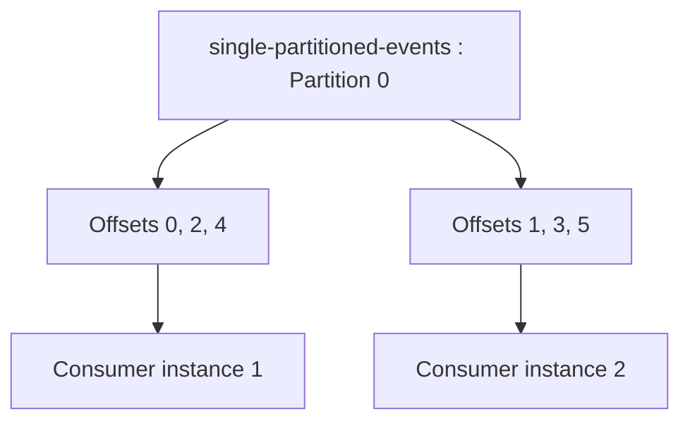

# Simple Kafka Share Consumer

This module demonstrates Kafka 4.x `KafkaShareConsumer` with explicit record
acknowledgements and a one-second processing delay. The consumer is configured
to process the topic `single-partitioned-events` as share group
`offsetzero-share-consumer-group`.

With more than one instance of this program running, Kafka shares records from
the single partition across the consumer instances. Each instance processes its
assigned records and commits its acknowledgements independently. This makes the
effect of share groups visible without partition rebalancing between multiple
partitions.

Kafka share groups are a Kafka 4.x preview feature introduced by KIP-932. The
broker must be Kafka 4.x with share groups enabled.

## Prerequisites

- Java 17+
- Maven 3.9+
- Kafka 4.x running on `localhost:9092`
- `kafka-topics.sh`, `kafka-configs.sh`, and `kafka-console-producer.sh`
- A Kafka installation with the commands above available, or their full paths

## Create The Topic

Create the topic with exactly one partition:

```bash
/path/to/kafka/bin/kafka-topics.sh \
	--bootstrap-server localhost:9092 \
	--create \
	--if-not-exists \
	--topic single-partitioned-events \
	--partitions 1 \
	--replication-factor 1
```

Replace `/path/to/kafka/bin` with the `bin` directory from your Kafka
installation. For a multi-broker cluster, use a replication factor supported by
your cluster instead of `1`.

## Configure Earliest Offset

Share consumers do not accept the regular client property
`auto.offset.reset`. Configure the share group setting on the broker using
`kafka-configs.sh`:

```bash
/path/to/kafka/bin/kafka-configs.sh \
	--bootstrap-server localhost:9092 \
	--entity-type groups \
	--entity-name offsetzero-share-consumer-group \
	--add-config share.auto.offset.reset=earliest \
	--alter
```

## Produce Events

Use scripts/produce-events.sh to produce 1-100 messages to kafka topic. Make sure to do necessary bin path changes alonside security configurations.

## Run The Consumer

Clone repository and run multiple instances of same program to see the effect.

The following example shows records from the same partition being delivered to
two instances of the same share consumer. Each instance acknowledges and commits
the records it processes:



This is an illustrative assignment, not a guaranteed alternating order. The
share coordinator assigns available records to members of the same share group,
including members reading from the same partition.

## Share Consumer Configuration

The example sets these properties in `SimpleShareKafkaConsumer`:

| Property | Value | Purpose |
| --- | --- | --- |
| `bootstrap.servers` | `localhost:9092` | Kafka broker address used to connect to the cluster. |
| `group.id` | `offsetzero-share-consumer-group` | Share group name. Instances using the same value share records. |
| `key.deserializer` | `StringDeserializer` | Converts record keys from bytes to strings. |
| `value.deserializer` | `StringDeserializer` | Converts record values from bytes to strings. |
| `max.poll.records` | `5` | Limits each poll result to at most five records. |
| `share.acknowledgement.mode` | `explicit` | Requires every record to be acknowledged with `ACCEPT`, `RELEASE`, or `REJECT`. |
| `share.acquire.mode` | `record_limit` | Uses the configured record limit when acquiring records for delivery. |

The consumer acknowledges each successfully processed record with `ACCEPT`,
then calls `commitSync()` for the batch. A record that is not acknowledged
before the next poll cannot be safely completed in explicit mode. The current
example sleeps for one second after each record to make concurrent share-group
processing easy to observe.
